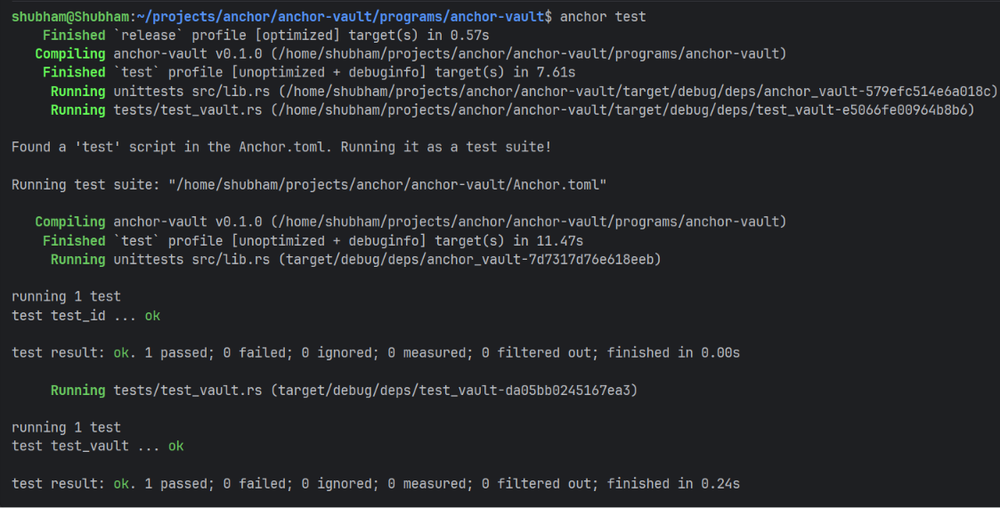

<!---->

# 🔐 Anchor Vault

A secure, non-custodial SOL vault program built on the **Solana blockchain** using the **Anchor framework**. Each user gets their own personal vault — a Program Derived Account (PDA) — where they can deposit, withdraw, and close at will, with no third-party risk.

---

## 📋 Table of Contents

- [Overview](#overview)
- [Program Architecture](#program-architecture)
- [Account Structure](#account-structure)
- [Instructions](#instructions)
  - [Initialize](#initialize)
  - [Deposit](#deposit)
  - [Withdraw](#withdraw)
  - [Close](#close)
- [PDA Design](#pda-design)
- [Project Structure](#project-structure)
- [Getting Started](#getting-started)
- [Running Tests](#running-tests)
- [Test Results](#test-results)
- [Program ID](#program-id)

---

## Overview

Anchor Vault is a minimal, production-style Solana smart contract (program) that demonstrates:

- **PDA-based user vaults** — each wallet gets its own isolated vault account
- **CPI transfers** — safe SOL movement using Anchor's `system_program::transfer`
- **PDA signing** — the vault PDA signs its own outgoing transfers using stored bumps
- **Clean account lifecycle** — initialize → deposit → withdraw → close

> This project is ideal as a reference implementation for anyone learning Anchor, PDAs, and CPI-based SOL management on Solana.

---

## Program Architecture

```
User Wallet (Signer)
      │
      ├──► vault_state PDA   (seeds: ["vault_state", signer])
      │         └── stores vault_bump + state_bump
      │
      └──► vault PDA         (seeds: ["vault", signer])
                └── holds the actual SOL
```

Two PDAs are derived per user:

| Account | Role |
|---|---|
| `vault_state` | Stores the bump seeds; acts as the program-owned state account |
| `vault` | A `SystemAccount` that holds the deposited SOL |

---

## Account Structure

### `VaultState`

```rust
#[account]
#[derive(InitSpace)]
pub struct VaultState {
    pub vault_bump: u8,   // bump for the vault PDA
    pub state_bump: u8,   // bump for the vault_state PDA
}
```

Both bumps are stored during `initialize` so that subsequent instructions can use them directly — avoiding the cost of recalculating bumps on every call.

---

## Instructions

### Initialize

Creates the `vault_state` and `vault` PDAs for the calling wallet.

```
Signer ──pays rent──► vault_state (init)
Signer ──derives──► vault (PDA, no data)
```

- `vault_state` is allocated with `8 + VaultState::INIT_SPACE` bytes
- Both bumps are captured from `ctx.bumps` and stored in `vault_state`
- Payer: the `signer`

---

### Deposit

Transfers a specified amount of lamports from the signer's wallet into their vault.

```
Signer ──(amount lamports)──► vault
```

- Uses `CpiContext::new` (no PDA signing needed — signer authorises directly)
- Validates both PDAs with their stored bumps before transfer

---

### Withdraw

Transfers a specified amount of lamports from the vault back to the signer.

```
vault ──(amount lamports)──► Signer
```

- Uses `CpiContext::new_with_signer` — the vault PDA must sign the outgoing transfer
- Signer seeds: `["vault", signer.key, vault_bump]`

---

### Close

Drains **all remaining SOL** from the vault back to the signer and closes the `vault_state` account (returning its rent).

```
vault ──(all lamports)──► Signer
vault_state ──(rent)──► Signer  [account closed]
```

- Uses `close = signer` constraint on `vault_state` to auto-close it
- Manually transfers remaining vault balance via CPI with PDA signer seeds
- After this instruction, both accounts no longer exist on-chain

---

## PDA Design

| PDA | Seeds | Purpose |
|---|---|---|
| `vault_state` | `["vault_state", signer_pubkey]` | Stores bumps; owned by the program |
| `vault` | `["vault", signer_pubkey]` | Holds SOL; a raw `SystemAccount` |

Using the signer's public key as part of the seed means **every wallet gets a unique, isolated vault** — no user can access another user's vault.

---

## Project Structure

```
programs/anchor-vault/src/
├── lib.rs                  # Program entry point; declares instructions
├── state.rs                # VaultState account definition
├── constants.rs            # Program constants (SEED)
├── error.rs                # Custom error codes
└── instructions/
    ├── mod.rs              # Re-exports all instructions
    ├── initialize.rs       # Initialize vault accounts
    ├── deposit.rs          # Deposit SOL into vault
    ├── withdraw.rs         # Withdraw SOL from vault
    └── close.rs            # Close vault and reclaim all SOL
```

---

## Getting Started

### Prerequisites

- [Rust](https://www.rust-lang.org/tools/install)
- [Solana CLI](https://docs.solana.com/cli/install-solana-cli-tools)
- [Anchor CLI](https://www.anchor-lang.com/docs/installation)
- [Node.js](https://nodejs.org/) (for tests)

### Install

```bash
git clone https://github.com/your-username/anchor-vault
cd anchor-vault
bun install
```

### Build

```bash
anchor build
```

### Deploy (Localnet)

```bash
anchor localnet
# or
solana-test-validator &
anchor deploy
```

---

## Running Tests

```bash
anchor test
```

This runs the full test suite against a local validator. Tests cover:

- ✅ Initializing the vault
- ✅ Depositing SOL
- ✅ Withdrawing SOL
- ✅ Closing the vault and reclaiming rent + balance

---

## Test Results

The image below shows all test cases passing successfully:


> All four core instructions — `initialize`, `deposit`, `withdraw`, and `close` — pass with correct balance assertions and account lifecycle validation.

---

## Program ID

```
EE74Pp8MwWrUnXMpK8j1tW115uSMH9RR1MS8wjvVEG7V
```

Declared in `lib.rs` via `declare_id!`. Update this after a fresh deploy to a new cluster.

---
